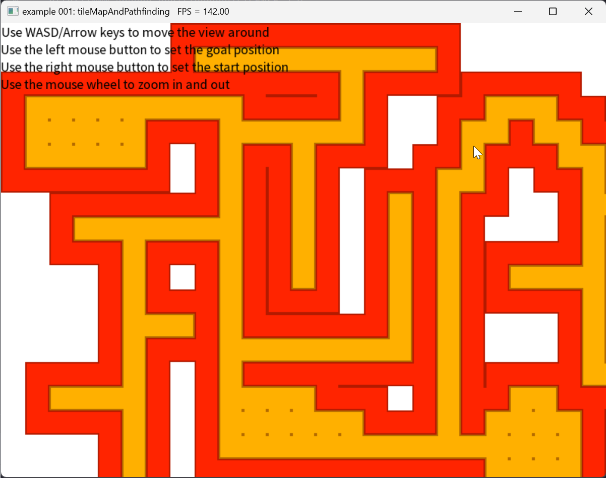
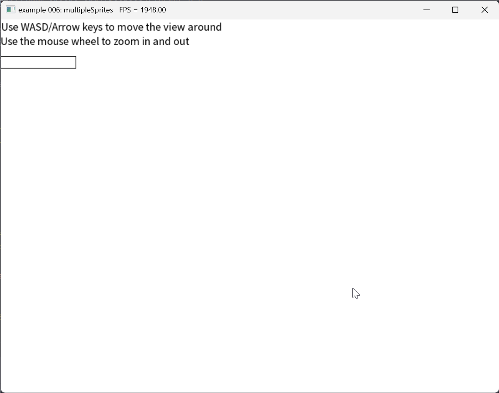

# FastEngine

Copyright (C) 2025 Guillaume Guillet

<table border="0px">
<tr>
<td>
Licensed under the Apache License, Version 2.0 (the "License");
</td>
</tr>
<tr>
<td>
You may not use this file except in compliance with the License.
You may obtain a copy of the License at

    http://www.apache.org/licenses/LICENSE-2.0

Unless required by applicable law or agreed to in writing, software
distributed under the License is distributed on an "AS IS" BASIS,
WITHOUT WARRANTIES OR CONDITIONS OF ANY KIND, either express or implied.
See the License for the specific language governing permissions and
limitations under the License.
</td>
</tr>
</table>

## Table of Contents
1. [Description](#description)
2. [Tools support](#tools)
3. [Documentation](#documentation)
4. [How to build / Build details](#how)
5. [CMake arguments](#cmakeargs)
6. [CMake targets](#cmaketargets)
7. [Windows](#windows)
8. [Linux](#linux)
9. [Mac OS](#mac)
10. [Installing](#installing)
11. [Examples](#examples)

## Description
 FastEngine is a 2D (targeted for 2D, 3D capable), multiplayer oriented framework on top of the [Vulkan](https://www.vulkan.org/) API. It brings a lot of tools and classes that can help mostly game development.

### Tools support
FastEngine must be built using a C++20 compatible compiler :
- For GNU/Linux : GCC-11 minimum
- For Windows : MINGW-W64, GCC-11 minimum
- - (32bits or UCRT 64bits)
- For MAC : AppleClang 13 minimum

Unsupported compiler/tools :
- Microsoft compiler, (it should work but is not tested on)

Working/supported architecture :
- 32bits
- 64bits
- ARM

FastEngine is built under C++20 and game/software that link to this library must be too.

### Documentation
You can find the latest Doxygen docs here : https://jonathspirit.github.io/FastEngine/

Vulkan specification here : https://registry.khronos.org/vulkan/specs/1.3-extensions/html/index.html

Note that this is a young project that need a ton of works for examples, documentations, tutorials ...

## How to build / Build details

You can check platform specific build instructions below this chapter.

First you should (if not already) clone the git repository :

    git clone https://github.com/JonathSpirit/FastEngine.git --recurse-submodules

You must first compile the dependencies by going into the **deps/** folder and then use CMake :

    cd deps
    mkdir build && cd build
    cmake ..
    cmake --build .

Then you can go to the **root directory** and configure the project like this : (don't forget the FGE_DEPS_PATH option)

    mkdir build && cd build
    cmake .. -DFGE_DEPS_PATH=deps/build/libs -DFGE_BUILD_DOC=ON -DFGE_BUILD_EXAMPLES=ON -DFGE_BUILD_TESTS=ON

Then use CMake to build the project (when building you can use the -j# argument to use multiple core) :

    cmake --build .

### CMake arguments
In order to tell CMake where to find the dependencies you have to specify the relative path to the **.../libs** folder generated by the **deps/CMakelists.txt** script :

    -DFGE_DEPS_PATH=deps/.../libs
You can specify the build type of the project by using :

    -DCMAKE_BUILD_TYPE=Release or Debug
By default, the project is in release mode.
You can build the Doxygen documentation by setting :

    -DFGE_BUILD_DOC=ON or OFF
By default, the documentation is built if the build type is **Release**. (You will need [Doxygen](https://doxygen.nl/) in order to build the doc.)

You can build all examples by setting :

    -DFGE_BUILD_EXAMPLES=ON or OFF
By default, the all examples are built inside the **all** target.

The library type flag (**BUILD_SHARED_LIBS**) must not be manually set and static build is not supported.

You can enable/disable tests by setting :

    -DFGE_BUILD_TESTS=ON or OFF
By default, the tests is always built and in order to run the tests, you should use :

    ctest

### CMake targets
- **all**
- - This is the default target, it will build everything configured.
- **FastEngine**
- - This will build the client (audio, graphics, window, ...) shared library.
- **FastEngineServer**
- - This will build the server (no audio, graphics or window dependencies) shared library.
- **doc_doxygen**
- - This will build the Doxygen documentation.
- **install**
- - Install the project, you can configure the project with CMAKE_INSTALL_PREFIX in order to change the location, but by default, it will install it inside the **install/** directory in **root**.

You can also build every example targets.

### Windows
Please install a [MINGW-W64](https://www.mingw-w64.org/) environment like [MSYS2](https://www.msys2.org/) (recommended) and make sure that either 32bits and/or 64bits GCC is correctly installed with proper CMake package.

Then you should just do the following in a **build/** folder :

    cmake .. -G"MinGW Makefiles"
and then build :

    cmake --build .
I recommend to add a little bit of power in the build with multicore argument :

    cmake --build . -j8

### Linux
Please install GCC-11 or higher in order to correctly compile :

    sudo apt update && sudo apt install gcc-11 g++-11
And then use CMake :

    cmake .. -G"Unix Makefiles" -DCMAKE_C_COMPILER=gcc-11 -DCMAKE_CXX_COMPILER=g++-11
    cmake --build . -j8

### Mac OS
For Mac OS you should just be able to do (after installing a correct AppleClang version) :

    cmake .. -G"Unix Makefiles"
    cmake --build . -j8

### Installing
The **install** target support CMake config export, and all the dependencies will be exported too in order to avoid
any overhead when linking to the library.

Once built, you can use :
    
    cmake --install .

By default, if no CMAKE_INSTALL_PREFIX is specified, it will install the library in **install/** in the project **root**
with a folder name like **FastEngine_Windows_64_Debug_0.9.1-441-g4a99f01**.

Once executed correctly, it will create a directory structure like this example :
- FastEngine_Windows_64_Debug_0.9.1-441-g4a99f01
  - bin
  - include
  - lib
  - share
  - - cmake
  - - external
  - - fge_changelog.txt
  - - IMAGE_AUDIO_LOGO_LICENSE
  - - LICENSE
  - - logo.png

## Examples
You can find examples in the **examples/** directory, you can build them by setting the **FGE_BUILD_EXAMPLES** flag to **ON**.

### Example 1 : tilemap and pathfinding
This example is a simple tilemap loaded from [Tiled](https://www.mapeditor.org/) with pathfinding using the [A* algorithm](https://en.wikipedia.org/wiki/A*_search_algorithm).

### Example 2 : lights and obstacles
This example is a simple scene with lights and obstacles. This show how to use the light system and the obstacle system.
This also use convex decomposition algorithm on the concave obstacles.

### Example 3 : GUI and window
This example is a simple scene with the GUI element system with multiple window.

### Example 4 : multiplayer example with a "life" simulator
This example show the multiplayer capacity of the engine with a full scene synchronisation.

### Example 5 : deep text
This example show the text rendering capacity of the engine with a simple scene.

### Example 6 : multiple ways to render sprites
This example show multiple ways to render sprites/shapes with the engine and the performance impact of each.

### Example 7 : mipmaps
This example show the mipmaps generation.

